# Krill Floating Ball

[中文简体](README.md) | English

Krill Floating Ball is a native macOS desktop widget for monitoring Krill AI subscription quota, usage statistics, cache rate, and wallet balance. It shows the current quota level as an 80px liquid floating ball, can snap to a slim edge progress bar near screen borders, and expands into a detailed hover panel.

> This project is an unofficial desktop companion for Krill AI. It is not affiliated with or endorsed by Krill AI. Quota, wallet, and usage values in screenshots are examples only.

## Preview

### Floating Ball And Expanded Panel

<p align="center">
  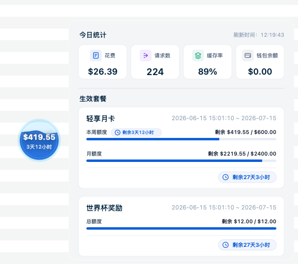
</p>

| Floating Ball | Expanded Panel |
| --- | --- |
|  | 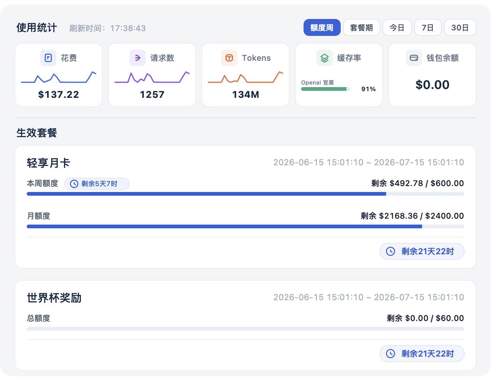 |

### Edge Progress Bar

When the widget is near a screen edge, it can snap into a progress bar. Left and right edges use a vertical bar, while top and bottom edges use a horizontal bar. Hovering still opens the full information panel.

| Edge Panel | Vertical Bar | Horizontal Bar |
| --- | --- | --- |
| 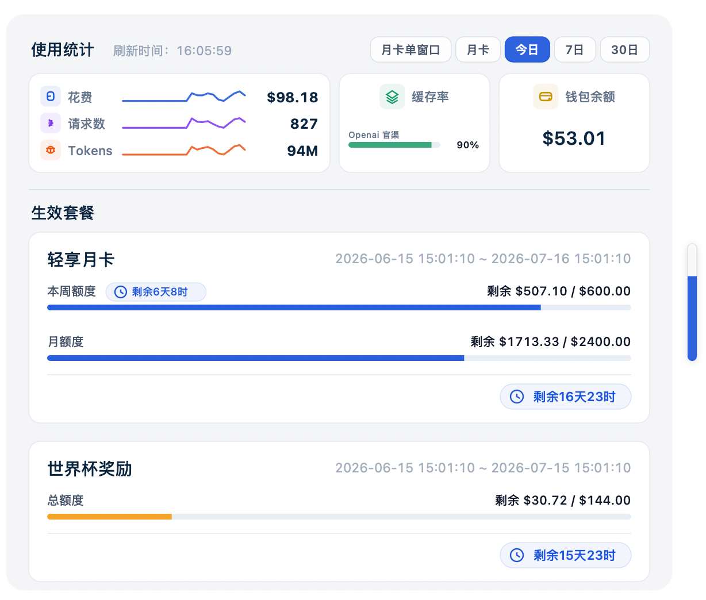 | 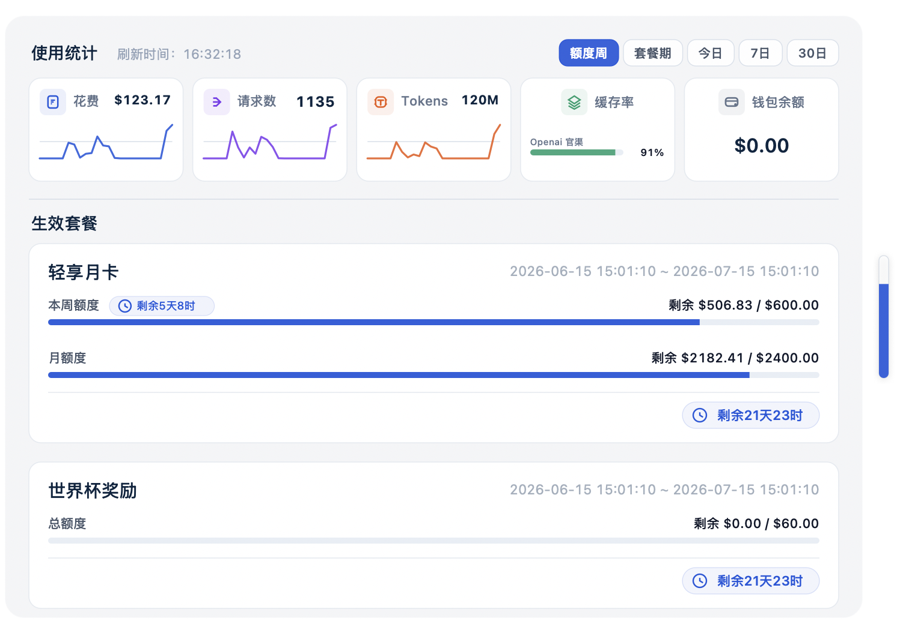 | 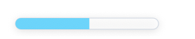 |

### Menu Bar And Login

| Menu Icon | Menu Actions | Login Prompt | Missing Account |
| --- | --- | --- | --- |
| 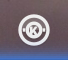 | 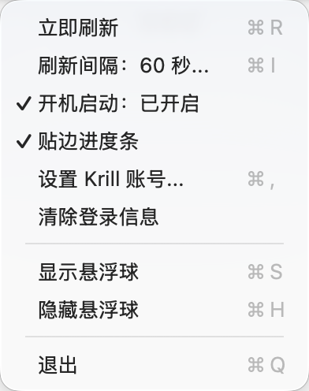 | 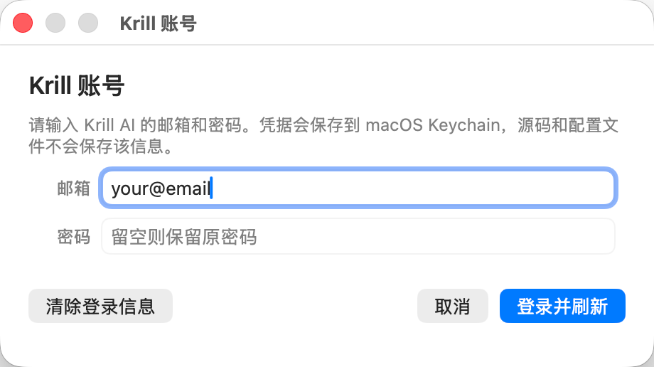 | 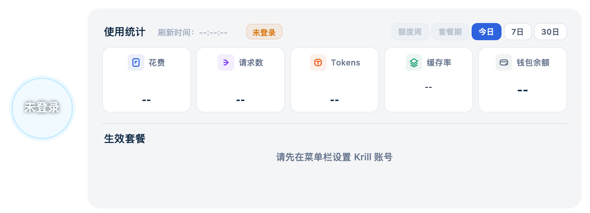 |

### Krill Account Comparison

<p align="center">
  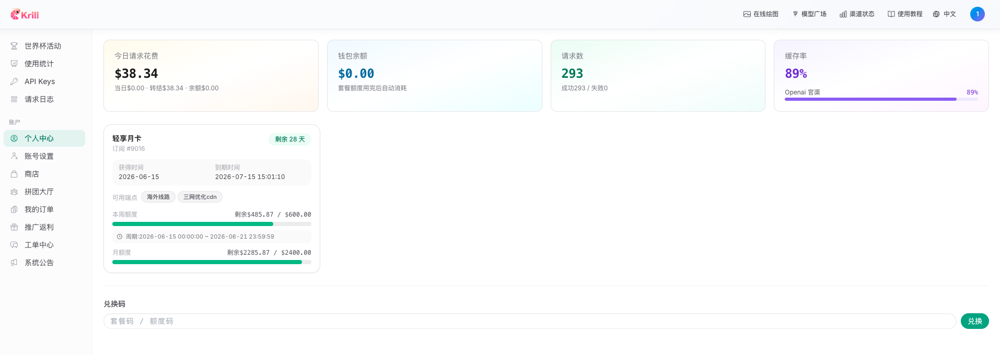
</p>

## Features

- Native Swift/AppKit implementation with no Dock icon and a persistent macOS menu bar item.
- Always-on-top draggable 80px liquid floating ball.
- Edge progress bar enabled by default: the widget snaps near screen edges, supports multi-display setups, and can be disabled from the menu bar.
- Hover panel showing usage statistics, wallet balance, refresh status, and all active subscriptions.
- Usage statistics ranges: `Quota Week`, `Subscription Period`, `Today`, `7 Days`, and `30 Days`.
- Spend, requests, and Tokens include sparklines; cache rate is shown per channel.
- Configurable automatic refresh interval, defaulting to 30 seconds. The next automatic refresh is scheduled after the previous refresh completes.
- Manual refresh, launch at login, balance-threshold settings, Krill account setup, login clearing, hide/show widget, and quit actions from the menu bar.
- Failed refreshes keep the last successful data and show a status badge beside the refresh time without overwriting the last successful refresh timestamp.
- Krill login credentials are stored in macOS Keychain. API tokens are obtained at runtime through login and are not written to source files or local configuration.

## Data Scope

### Active Subscriptions

Active subscriptions are filtered with:

```text
active = true && now >= subscription_start_at && now < subscription_end_at
```

Subscription cards are sorted by remaining total quota from high to low.

### Subscription Quota

- The app aggregates currently available quota from active time ranges, quota windows, and returned quota fields.
- The expanded panel displays each active item as weekly quota, monthly quota, or total quota according to the resolved quota type.
- Wallet balance is displayed as a separate balance and is not merged into subscription cards.

### Floating Ball Level

The floating ball represents the current available quota pool, not a single subscription. If the quota pool is exhausted while wallet balance is still available, the ball switches to balance mode.

The liquid level and edge progress bar are based on remaining percentage:

| Remaining Quota | Alert Color |
| --- | --- |
| `> 60%` | Blue, sufficient quota |
| `> 30%` | Cyan-blue, healthy but worth watching |
| `> 10%` | Amber, low quota |
| `<= 10%` | Red, critical quota |

Balance mode has no fixed total-quota denominator, so it does not show a liquid percentage. It uses balance-level colors instead, and the balance thresholds can be adjusted from the menu bar.

### Usage Statistics

Usage statistics are read from Krill request-log stats. The main fields are:

- Spend: `total_cost_usd`
- Requests: `total_requests`
- Tokens: `total_tokens`
- Cache rate: `channel_cache_rates`

`Today` uses the user's local calendar day. Large ranges are requested in smaller chunks and parsed for only the required fields to reduce peak memory usage when switching ranges.

## Requirements

- macOS 13.0 or later.
- The current prebuilt release asset targets Apple Silicon Macs.
- Swift 6.0 or later when building from source.

## Install From Release

1. Open [GitHub Releases](https://github.com/lightconelab/krill-floating-ball/releases/latest).
2. Download the latest `Krill-Floating-Ball-v*-macOS-arm64.zip`.
3. Unzip it and open `Krill Floating Ball.app`.
4. On first launch, enter your Krill AI email and password, or choose `设置 Krill 账号...` from the menu bar.

The current prebuilt app is ad-hoc signed but not notarized with an Apple Developer ID. If macOS blocks the first launch, right-click the app and choose `Open`, or allow it in `System Settings -> Privacy & Security`.

## Build From Source

```bash
git clone https://github.com/lightconelab/krill-floating-ball.git
cd krill-floating-ball
./scripts/build_app.sh
open "dist/Krill Floating Ball.app"
```

Create a local release zip:

```bash
./scripts/package_release.sh
```

Build outputs are written to `dist/`. `dist/`, `.build/`, and zip files are ignored by Git.

## Usage

1. Launch `Krill Floating Ball.app`.
2. Enter your Krill AI email and password in the first-launch prompt.
3. Drag the floating ball to a preferred position.
4. Hover over the floating ball or edge progress bar to inspect detailed usage.
5. Use the menu bar to refresh manually, change the automatic refresh interval, adjust balance thresholds, enable or disable launch at login, enable or disable edge progress bar mode, clear login information, or quit the app.

## Performance

Krill Floating Ball is drawn with native AppKit and does not use Electron or WebView. The app releases the hover panel window after collapse and reduces drawing and window overhead while hidden. Release builds use `-Osize` and strip the executable with `strip -x`.

Actual CPU, memory, and energy impact depend on the device, macOS version, display scaling, selected statistic range, and API response size. The screenshots below are from one local run and should be treated as rough reference points.

| Floating Ball CPU | Edge Progress Bar CPU |
| --- | --- |
| 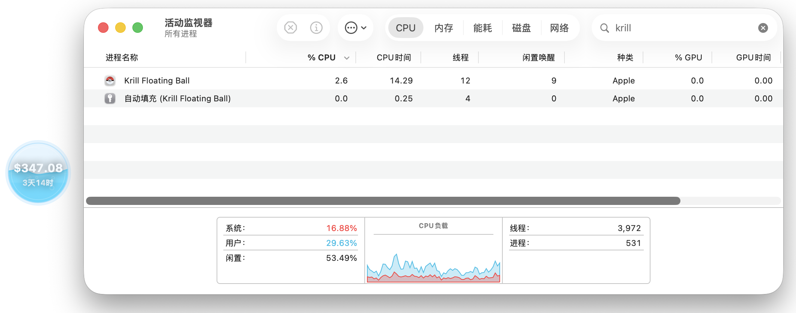 | 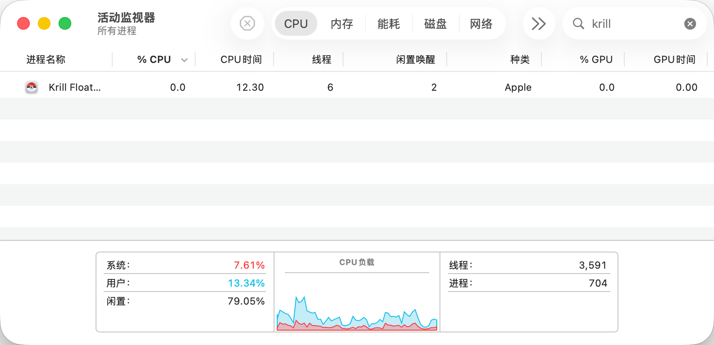 |

| Memory Usage | Energy Impact |
| --- | --- |
| 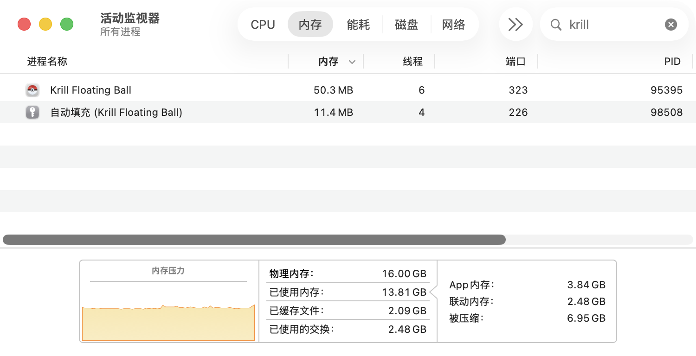 | 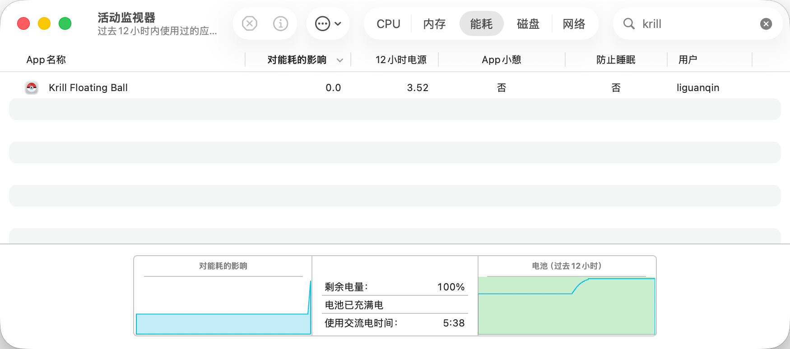 |

## Privacy

- The app calls Krill APIs directly from your Mac.
- Krill email and password are stored in macOS Keychain.
- API tokens are obtained at runtime and are not written to the repository, source files, or local config files.
- The project does not include analytics, telemetry, crash reporting, or third-party tracking SDKs.

## Project Layout

```text
Sources/TrellisFloatingBall/   macOS AppKit source code
Resources/                     Info.plist and app icon resources
scripts/                       Build and packaging scripts
docs/images/                   README screenshots
dist/                          Local build output, ignored by Git
```

## Notes

Krill AI APIs and response fields may change over time. If the API response shape changes, the app may need an update. Please include reproduction steps, screenshots, macOS version, and app version when opening an issue.

## License

MIT. See [LICENSE](LICENSE).
