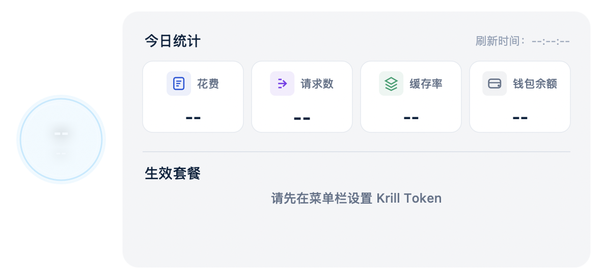
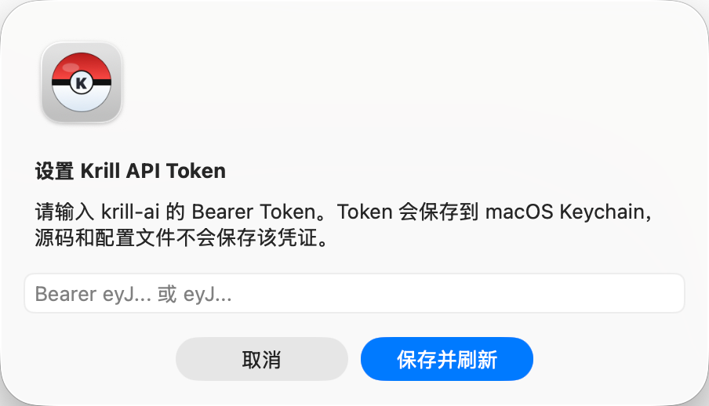
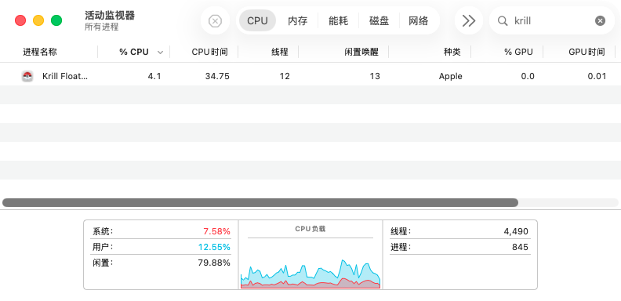

# Krill Floating Ball

[English](README.en.md) | 中文简体

Krill Floating Ball 是一个低开销的 macOS 原生悬浮球应用，用于在桌面置顶查看 Krill AI 套餐额度、今日统计和钱包余额。

> 这是一个用于查看 Krill AI 使用情况的非官方桌面工具，与 Krill AI 官方无关联，也不代表 Krill AI 官方背书。

## 截图

| 菜单栏图标 | 菜单栏功能选项 |
| --- | --- |
|  |  |

| 悬浮球和展开栏整体效果 | 展开栏 | 悬浮球 |
| --- | --- | --- |
|  |  |  |

| 贴边进度条和展开栏整体效果 | 贴边剩余额度悬浮条（水平） |
| --- | --- |
|  |  |

| 未配置 Token 状态 | 输入 Token 弹窗 |
| --- | --- |
|  |  |

| Krill 个人中心数据对比 |
| --- |
|  |

| CPU 开销 | 内存占用 | 能耗影响 |
| --- | --- | --- |
|  |  |  |

| 贴边悬浮条 CPU 占用 | 悬浮球 CPU 占用 |
| --- | --- |
|  |  |

## 功能

- Swift/AppKit 原生实现，无 Dock 图标，菜单栏常驻。
- 80px 桌面置顶悬浮球，可拖动。
- 靠近屏幕边缘时默认自动吸附为细长剩余额度进度条，可在菜单栏关闭。
- 低开销绘制策略，悬浮球动画按需运行，展开栏收起后释放面板窗口。
- 液体额度指示器：水位跟随周剩余额度百分比变化，低额度时颜色和闪烁效果更醒目。
- 鼠标悬浮时展示使用统计、钱包余额、刷新时间和所有生效套餐，并可与 Krill 个人中心数据对照。
- 使用统计支持额度周、套餐期、今日、7 日和 30 日范围，花费、请求数、Tokens 会展示趋势折线，缓存率按渠道显示。
- 支持在菜单栏设置自动刷新间隔，默认每 30 秒刷新一次；自动刷新会在上一次请求完成后顺延计时。
- 菜单栏支持手动刷新、设置 Token、清除 Token、开机启动开关和退出应用。
- 刷新失败时保留上一次成功数据，并且不会覆盖上一次成功刷新时间。
- Krill API Token 保存到 macOS Keychain，不写入源码或本地配置文件。
- 应用图标和菜单栏图标采用精灵球风格的 `K` 标识，菜单栏图标会随系统外观显示为黑色或白色。

## 系统要求

- macOS 13.0 或更高版本。
- 预构建 Release 包当前面向 Apple Silicon Mac。
- 从源码构建需要 Swift 6.0 或更高版本。

## 下载安装

1. 从 [GitHub Releases](https://github.com/lightconelab/krill-floating-ball/releases/latest) 下载最新 zip。
2. 解压 `Krill-Floating-Ball-v0.2.4-macOS-arm64.zip`。
3. 打开 `Krill Floating Ball.app`。
4. 首次启动时输入 Krill API Token，或从菜单栏选择 `设置 Krill Token...`。

当前应用已做 ad-hoc 签名，但没有使用 Apple Developer ID 公证。首次打开时，如果 macOS 阻止启动，可以右键点击 App 选择 `打开`，或在 `系统设置 -> 隐私与安全性` 中允许打开。

## 从源码构建

```bash
git clone https://github.com/lightconelab/krill-floating-ball.git
cd krill-floating-ball
./scripts/build_app.sh
open "dist/Krill Floating Ball.app"
```

本地生成 Release zip：

```bash
./scripts/package_release.sh
```

构建产物会输出到 `dist/` 目录。

## 使用方式

1. 启动 `Krill Floating Ball.app`。
2. 按提示输入 Krill API Token，或从菜单栏选择 `设置 Krill Token...`。
3. 拖动悬浮球到合适的位置。
4. 鼠标悬浮在球体上查看使用统计、钱包余额和生效套餐。
5. 通过菜单栏手动刷新、修改自动刷新间隔、开启或关闭开机启动、清除 Token 或退出应用。

## 数据口径

- 生效套餐会按 `active = true` 且当前时间位于 `subscription_start_at` 与 `subscription_end_at` 之间筛选。
- 悬浮球展示的是当前周周期可用池：有周额度的生效套餐 + 与该周周期时间范围重叠的其他生效总额度套餐。
- 悬浮球液体颜色按当前周周期可用池的剩余额度百分比分级提醒。
- `plan.billing_type = usd_monthly` 时，套餐总额度按 `quota.daily_limit_usd` 计算，且不计入周额度。
- `plan.billing_type = usd_weekly` 时，周限额按 `quota.daily_limit_usd` 计算，套餐总额度按 `quota.daily_limit_usd * 4` 计算。
- 使用统计支持按额度周、套餐期、今日、近 7 日和近 30 日请求；今日范围按用户本机时区的自然日 `00:00:00` 到当前时间计算。
- 如果接口刷新失败，应用会等待下一次自动刷新或手动刷新，并保持上一次成功刷新时间不变。

## 隐私说明

- 应用直接从用户 Mac 调用 Krill API。
- API Token 保存到 macOS Keychain。
- 仓库不包含 Token、密钥、埋点、遥测或崩溃上报。

## 开发说明

Release 产物不会提交到 Git 仓库。`.build/`、`dist/` 和 zip 包已通过 `.gitignore` 排除；可下载的 App Bundle 通过 GitHub Releases 分发。

## 许可证

MIT。详见 [LICENSE](LICENSE)。
