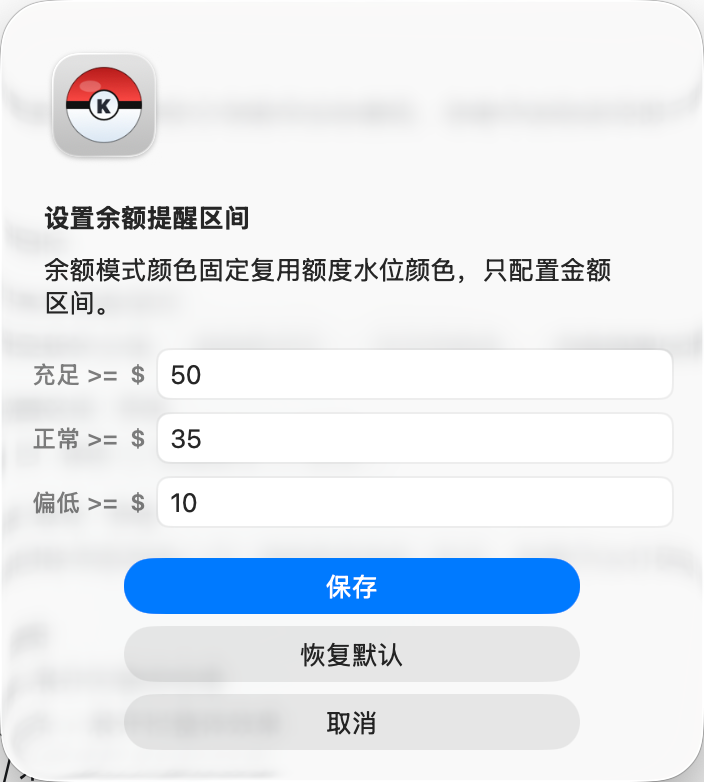

# Krill Floating Ball

中文简体 | [English](README.en.md)

Krill Floating Ball 是一个原生 macOS 桌面悬浮工具，用于快速查看 Krill AI 的套餐额度、使用统计、缓存率和钱包余额。它以 80px 液体悬浮球展示当前额度水位，贴近屏幕边缘时可自动切换为细长贴边进度条，鼠标悬浮后展开完整信息面板。

> 本项目是 Krill AI 的非官方桌面辅助工具，与 Krill AI 官方无关联，也不代表 Krill AI 官方背书。截图中的额度、钱包和使用数据仅作界面示例。

## 预览

### 悬浮球与展开栏

<p align="center">
  
</p>

| 悬浮球 | 展开栏 |
| --- | --- |
|  |  |

### 贴边进度条

贴近屏幕边缘时，悬浮球可以自动吸附为进度条。左右边缘显示竖向进度条，上下边缘显示横向进度条；鼠标悬浮时仍会展开完整信息面板。

| 贴边展开 | 竖向贴边条 | 横向贴边条 |
| --- | --- | --- |
|  |  |  |

### 菜单栏与账号

| 菜单栏图标 | 菜单栏功能 | 余额提醒区间 |
| --- | --- | --- |
|  |  |  |

| Krill 账号 | 未配置账号 |
| --- | --- |
|  |  |

### 数据对比

<p align="center">
  
</p>

## 功能

- 原生 Swift/AppKit 实现，无 Dock 图标，常驻 macOS 菜单栏。
- 桌面置顶 80px 液体悬浮球，可拖拽定位。
- 默认开启贴边进度条：靠近屏幕边缘自动吸附，支持多显示器场景，可在菜单栏关闭。
- 鼠标悬浮展示展开栏，包含使用统计、钱包余额、刷新状态和所有生效套餐。
- 使用统计支持 `额度周`、`套餐期`、`今日`、`7日`、`30日`。
- 花费、请求数和 Tokens 展示趋势折线；缓存率按渠道展示进度条。
- 自动刷新间隔可配置，默认 30 秒；下一次自动刷新会在上一次刷新完成后顺延计时。
- 支持手动刷新、开机启动、余额提醒区间设置、Krill 账号管理、桌面悬浮球显示开关、贴边进度条开关和退出应用。
- 刷新失败时保留上一次成功数据，并在刷新时间旁显示状态标签，不覆盖上一次成功刷新时间。
- Krill 登录凭据保存到 macOS Keychain，运行时登录获取接口 Token，Token 不写入源码或配置文件。

## 数据口径

### 生效套餐

生效套餐按以下条件筛选：

```text
active = true && now >= subscription_start_at && now < subscription_end_at
```

套餐卡片按 `subscription` 接口响应中 `subscriptions` 的原始顺序展示，仅排除未生效或已过期套餐。

### 套餐额度

- 应用会根据接口返回的生效时间、额度窗口和额度字段聚合当前可用额度。
- 展开栏会按套餐实际类型展示 `本周额度`、`月额度` 或 `总额度`。
- 钱包余额作为独立资金余额展示，不混入套餐卡片。

### 悬浮球水位

悬浮球展示当前可用额度池，而不是单个套餐额度。若额度池已耗尽但钱包余额仍可用，悬浮球会切换为余额模式。

液体水位和贴边进度条按剩余额度百分比展示，提醒颜色规则如下：

| 剩余额度百分比 | 颜色含义 |
| --- | --- |
| `> 60%` | 蓝色，额度充足 |
| `> 30%` | 蓝青色，额度正常但需要关注 |
| `> 10%` | 琥珀色，额度偏低 |
| `<= 10%` | 红色，额度紧张 |

余额模式没有固定总额度分母，因此不展示液体百分比，仅按余额区间显示状态颜色。余额提醒区间可从菜单栏调整。

### 使用统计

使用统计来自 Krill 的请求日志统计接口，字段口径包括：

- 花费：`total_cost_usd`
- 请求数：`total_requests`
- Tokens：`total_tokens`
- 缓存率：`channel_cache_rates`

`今日` 按用户本机时区的自然日计算。大范围统计会按较小时间片请求并只提取必要字段，以降低切换统计范围时的峰值内存占用。

## 系统要求

- macOS 13.0 或更高版本。
- 当前预构建 Release 包面向 Apple Silicon Mac。
- 从源码构建需要 Swift 6.0 或更高版本。

## 下载安装

1. 打开 [GitHub Releases](https://github.com/lightconelab/krill-floating-ball/releases/latest)。
2. 下载最新的 `Krill-Floating-Ball-v*-macOS-arm64.zip`。
3. 解压后打开 `Krill Floating Ball.app`。
4. 首次启动时输入 Krill AI 邮箱和密码，或从菜单栏选择 `Krill 账号`。

当前预构建包已做 ad-hoc 签名，但没有使用 Apple Developer ID 公证。首次打开时如果被 macOS 阻止，可以右键点击 App 选择 `打开`，或在 `系统设置 -> 隐私与安全性` 中允许打开。

## 从源码构建

```bash
git clone https://github.com/lightconelab/krill-floating-ball.git
cd krill-floating-ball
./scripts/build_app.sh
open "dist/Krill Floating Ball.app"
```

生成本地 Release zip：

```bash
./scripts/package_release.sh
```

构建产物会输出到 `dist/` 目录。`dist/`、`.build/` 和 zip 包不会提交到 Git 仓库。

## 使用方式

1. 启动 `Krill Floating Ball.app`。
2. 在首次弹窗中输入 Krill AI 邮箱和密码。
3. 拖动悬浮球到合适位置。
4. 鼠标悬浮在悬浮球或贴边进度条上查看完整使用情况。
5. 在菜单栏中手动刷新、显示或隐藏桌面悬浮球、开启或关闭贴边进度条、调整自动刷新间隔、调整余额提醒区间、开启或关闭开机启动、管理 Krill 账号或退出应用。

## 性能

Krill Floating Ball 使用原生 AppKit 绘制，不依赖 Electron 或 WebView。应用会在展开栏收起后释放面板窗口，隐藏状态下减少绘制和窗口开销；Release 构建使用 `-Osize` 并对可执行文件执行 `strip -x`。

实际 CPU、内存和能耗会受设备、macOS 版本、显示器缩放、统计范围和接口数据量影响。以下截图来自一次本地运行，仅作为量级参考。

| 悬浮球 CPU | 贴边进度条 CPU |
| --- | --- |
|  |  |

| 内存占用 | 能耗影响 |
| --- | --- |
|  |  |

## 隐私

- 应用直接从用户 Mac 调用 Krill API。
- Krill 邮箱和密码保存到 macOS Keychain。
- API Token 仅在运行时登录获取，不写入仓库、源码或本地配置文件。
- 项目不包含埋点、遥测、崩溃上报或第三方统计 SDK。

## 项目结构

```text
Sources/TrellisFloatingBall/   macOS AppKit 源码
Resources/                     Info.plist 和 App 图标资源
scripts/                       构建与打包脚本
docs/images/                   README 截图资源
dist/                          本地构建产物，已忽略
```

## 说明

Krill AI 接口和字段可能随官方调整而变化。如果接口响应结构变化，应用可能需要同步适配。欢迎通过 Issue 反馈复现步骤、截图、macOS 版本和应用版本。

## 许可证

MIT。详见 [LICENSE](LICENSE)。
